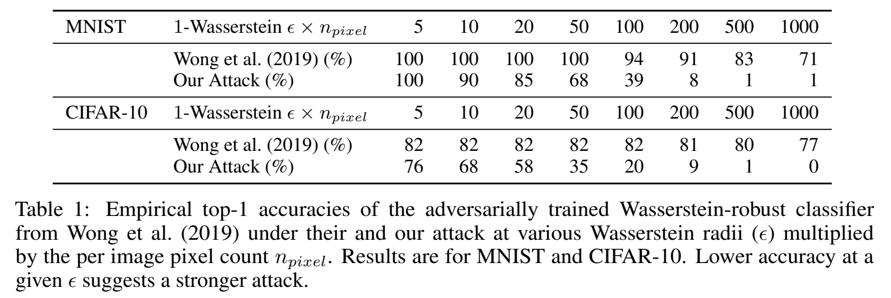
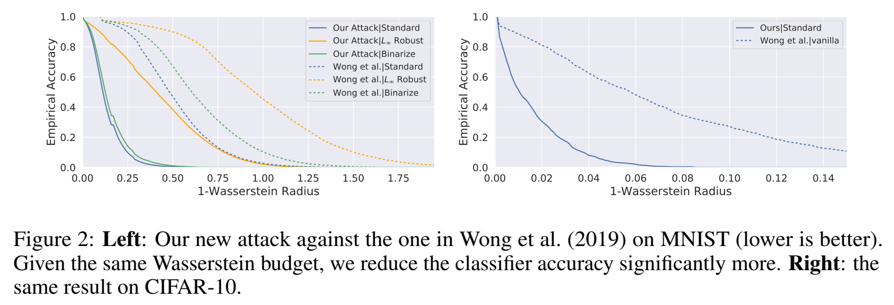
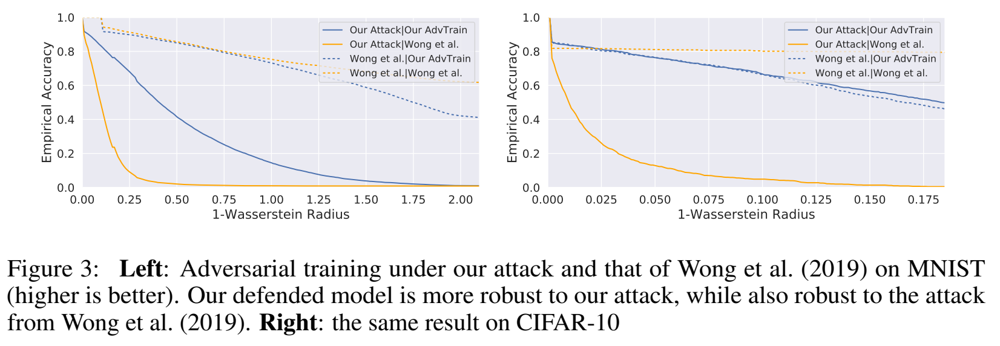

# Improved Image Wasserstein Attacks and Defenses

Last update: April 2020.

---

Code to accompany our paper:

**Improved Image Wasserstein Attacks and Defenses**  
*J. Edward Hu, Adith Swaminathan, Hadi Salman, Greg Yang.*  
[[arXiv Link to Manuscript]](https://arxiv.org/abs/2004.12478)

We introduce a better-defined Wasserstein threat model for images and propose a significantly stronger attack.





Our code is based on [Wong et al. (2019)](https://arxiv.org/abs/1902.07906), whose repo can be found [here](https://github.com/locuslab/projected_sinkhorn).

## Getting Started

Clone our repository and install dependencies:

```shell
git clone https://github.com/edwardjhu/improved_wasserstein.git
conda create --name improved_wasserstein python=3.6
conda activate improved_wasserstein
conda install numpy matplotlib pandas seaborn -y
conda install pytorch torchvision cudatoolkit=10.0 -c pytorch -y
pip install tqdm
```

## Experiments

### Reproducing Our Attacks
To reproduce our SOTA attack result on the Wasserstein-robust model from Wong et al. (2019) on MNIST, simply run:

```shell
python attack_mnist_baseline.py \
--checkpoint=checkpoints/mnist_adv_training_wong.pth
```
For our SOTA attack result on the Wasserstein-robust model from Wong et al. (2019) on CIFAR-10:
```shell
python attack_cifar_baseline.py \
--checkpoint=checkpoints/cifar_adv_training_wong.pth
```
We can also recreate the attack from Wong et al. (2019) by running:
```shell
python attack_mnist_baseline.py \
--checkpoint=checkpoints/mnist_adv_training_wong.pth \
--norm=linfinity \
--alpha=0.1
```
For the binarized baseline, please pass in an additional argument:
```shell
python attack_mnist_baseline.py \
--checkpoint=checkpoints/mnist_binarize.pth \
--binarize
```

The attack script will generate a two-column TSV file in `epsilons/` with a name unique to the attack hyperparameters.
The first column is the index of data points in the MNIST (or CIFAR-10) test set, and the second column is the Wasserstein radii at which the data points are misclassified (`inf` means failed to attack).

The runtime of the attack is dependent on the attack and the pretrained model. For reference, it takes about 27 minutes to run the attack on the MNIST test set against the Wasserstein-robust model from [Wong et al. (2019)](https://arxiv.org/abs/1902.07906) on a NVIDIA Tesla P100. The ETA provided by `tqdm` is inaccurate; the first number printed is the percentage of the batch still classified correctly, which decreases monotonically. The second number is the current attack radius.

For example, the status below suggests that 59.8% of the test set is classified correctly under a Wasserstein attack radius of 0.005. The radius will be raised another 395 times unless all the data points are misclassified.
```shell
59.8 0.005:   1%|▋                                                  | 5/400 [00:32<42:00,  6.38s/it]
```

### Reproducing Our Defenses

Adversarially training against our new attack provides a better defense against it compared to previous baselines.


To adversarially train a LeNet on MNIST from scratch with our default hyperparameters, simply run:
```shell
python adv_training_mnist.py
```

For a ResNet18 on CIFAR-10:
```shell
python adv_training_cifar.py
```

Note that adversarial training is slow. We provide our pretained models obtained by running the above commands, `mnist_adv_training_ours.pth` (trained for 100 epochs) and `cifar_adv_training_ours.pth` (trained for 200 epochs).

## Plotting the Result

To produce a plot of the empirical accuracy under attack in the style of our paper, simply run:
```shell
python plot/plot_result.py \
--result=epsilons/mnist_adv_training_wong.pth_reg_1000_p_1_alpha_0.06_norm_grad_ball_wasserstein_new-form_clamping.txt \
--title="Empirical Accuracy Under 1-Wasserstein Attack" \
--save="my_plot"
```
This will generate `my_plot.pdf` and `my_plot.png`. Here we assume that the reader has run the first attack example.

The plotting code is adopted from [here](https://github.com/Hadisalman/smoothing-adversarial/blob/master/code/analyze.py).

## Pre-trained Models

Our pre-trained models are available in `checkpoints/`. 

They are either non-robust baselines:
- `mnist_vanilla.pth`: a vanilla MNIST model used in Wong et al. (2019).
- `cifar_vanilla.pth`: a vanilla CIFAR-10 model used in Wong et al. (2019).

baselines robust to non-Wasserstein adversaries:
- `mnist_binarize.pth`: a MNIST model that uses binarized inputs from Wong et al. (2019).
- `mnist_linf_robust.pth`: a CIFAR-10 model that is certifiably robust to a  radius of 0.1 from Wong et al. (2019).

or adversarially trained Wasserstein robust models:
- `mnist_adv_training_wong.pth`: a MNIST model adversarially trained against the Wasserstein attack from Wong et al. (2019).
- `cifar_adv_training_wong.pth`: a CIFAR-10 model adversarially trained against the Wasserstein attack from Wong et al. (2019).
- `mnist_adv_training_ours.pth`: a MNIST model adversarially trained against the Wasserstein attack from this work.
- `cifar_adv_training_ours.pth`: a CIFAR-10 model adversarially trained against the Wasserstein attack from this work.


## Repository

1. `epsilons/` is used to store attack results.
2. `checkpoints/` is used to store pretrained model and checkpoints during adversarial training.
3. `plot/` is used to generate plots of empirical accuracy under attack from attack results.
4. `projected_sinkhorn/` contains the implementation of our constrained Sinkhorn iteration algorithm.
5. `models/` contains the definitions of the models we use.
6. `attack_{mnist,cifar}_baseline.py` is used to attack pretrained {MNIST, CIFAR-10} models and save results to `epsilons/`.
7. `adv_training_{mnist,cifar}.py` is used to adversarially train against our Wasserstein adversary on {MNIST, CIFAR-10} and save checkpoints to `checkpoints/`.
8. `pgd.py` is the core implementation of projected gradient descent algorithm.

Our code is based on [Wong et al. (2019)](https://arxiv.org/abs/1902.07906), whose repo can be found [here](https://github.com/locuslab/projected_sinkhorn).

[[Click here to access our manuscript]](https://arxiv.org/abs/2004.12478)
